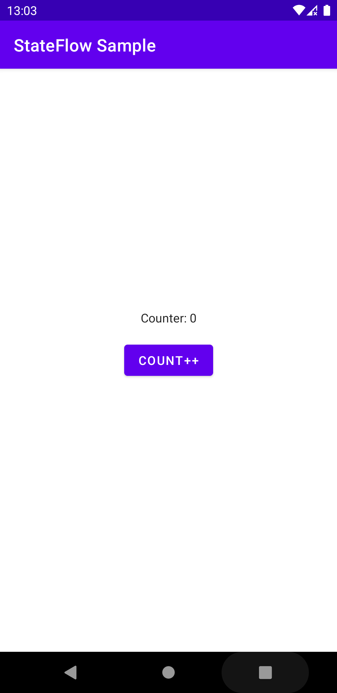

# StateFlow Sample
 
 

 ## Overview
 Test about StateFlow (similar LiveData)
 
 ## Use Instructions
 
 * Gradle configuration
 ```gradle
 def lifecycle_version = "2.4.0-alpha02"
 implementation "androidx.lifecycle:lifecycle-viewmodel-ktx:$lifecycle_version"
 implementation "androidx.activity:activity-ktx:1.2.3"
 implementation 'org.jetbrains.kotlinx:kotlinx-coroutines-android:1.5.0'
 ```
* ViewModel
    * note: Always same pattern.
```
        private val _NAME = MutableStateFlow(TYPE)
        val NAME: StateFlow<TYPE> get() = _NAME 
```
```kotlin
class MainViewModel: ViewModel() {
    private val _count = MutableStateFlow(0)
    val count: StateFlow<Int> get() = _count

    fun incrementCount(){
        _count.value = _count.value.plus(1)
    }
}
```

* Activity using ViewModel
```kotlin
class MainActivity : AppCompatActivity() {

    private val vm by viewModels<MainViewModel>()

    @SuppressLint("SetTextI18n")
    override fun onCreate(savedInstanceState: Bundle?) {
        super.onCreate(savedInstanceState)
        val binding = ActivityMainBinding.inflate(layoutInflater)
        setContentView(binding.root)

        binding.button.setOnClickListener { vm.incrementCount() }

        lifecycleScope.launchWhenStarted {
            vm.count.collect {
                binding.textView.text = "Counter: $it"
            }
        }
    }
}
```